<!-- ===================== BANNER ===================== -->

<p align="center">
  
</p>

<h1 align="center">Hi 👋, I'm Sagor Dev</h1>

<p align="center">
  
</p>

<p align="center">
<a href="https://github.com/Sagordev1">

</a>
<a href="https://www.linkedin.com/in/sagor-dev-6135652ab/">

</a>
<a href="mailto:bicitrodevsagor2002@gmail.com">

</a>
</p>

<p align="center">

</p>

<p align="center">
  <a href="https://github.com/Sagordev1">
    
  </a>
</p>

---

# 👨‍💻 About Me

I'm a **Computer Science and Engineering** student at **Metropolitan University, Bangladesh**, with a strong interest in Web Development and Software Engineering.

I enjoy building software from frontend interfaces to backend APIs and databases. Currently, my primary focus is on **MERN Stack Development, Advanced JavaScript**, and building practical full-stack web applications.

I'm continuously learning, building projects, and strengthening my programming and problem-solving skills to grow as a Full-Stack Developer.

- 🔭 Currently working on **BrainBoost**
- 🤝 Looking to collaborate on **Hospital Management System**
- 🌱 Currently exploring **Full Stack Development & Machine Learning**
- 💡 Interested in **React, Node.js, MongoDB, JavaScript & Python**
- 🧠 Always learning new technologies
- 💬 Ask me about **Web Development, JavaScript, React & Git**
- 📫 Reach me at **bicitrodevsagor2002@gmail.com**

---

# 💻 Full-Stack Development

I'm currently developing my skills across the complete web development stack.

**Frontend**
`React.js` `JavaScript` `HTML` `CSS` `Tailwind CSS`

**Backend**
`Node.js` `Express.js` `REST APIs`

**Database**
`MongoDB` `MongoDB Atlas` `MySQL`

# 🚀 Featured Projects

<table>
<tr>

<td width="50%">

## 🧠 BrainBoost

A quiz-based learning platform designed to make learning interactive and engaging.

**Technologies**

`React` `Node.js` `Express` `MongoDB`

<br>

<a href="https://github.com/Sagordev1/BrainBoost">

</a>

</td>

<td width="50%">

## 🏥 Hospital Management System

A web-based hospital management system for managing patients, doctors and hospital information.

**Technologies**

`Flask` `Python` `MySQL`

<br>

<a href="https://github.com/Sagordev1/Hospital-management-system">

</a>

</td>

</tr>
</table>

---

# 🛠️ Tech Stack

## 💻 Languages

<p align="center">
  
</p>

## 🎨 Frontend

<p align="center">
  
</p>

## ⚙️ Backend

<p align="center">
  
</p>

## 🗄️ Database

<p align="center">
  
</p>

## ☁️ Tools & Technologies

<p align="center">
  
</p>

## 📱 Other Technologies

<p align="center">
  
</p>

# 📊 GitHub Statistics

## 📈 GitHub Stats

<p align="center">
  
  
</p>

---

## 💻 Most Used Languages

<p align="center">
  
</p>

---

## 📚 Languages by Repository

<p align="center">
  
  
</p>

---

# 📅 GitHub Contributions

<p align="center">
  
</p>

---

# 📈 GitHub Activity

<p align="center">
  
</p>

---

# 🏆 GitHub Trophies

<p align="center">
  
</p>

---

# 🐍 Contribution Snake

<p align="center">
  
  
</p>

---

# 🎯 Current Goals

```text
🚀 Build production-ready Full Stack applications

🤖 Explore Machine Learning & Artificial Intelligence

🌐 Contribute to Open Source

🧠 Improve Problem Solving & Algorithms

💻 Become a Better Software Engineer

📚 Keep Learning New Technologies
```

---

# 📚 Currently Learning

<p align="center">
  
</p>

- ⚛️ Advanced React
- 🟢 Node.js & Express.js
- 🍃 MongoDB
- 🐍 Python & Machine Learning
- 🐳 Docker
- 🔧 Git & GitHub
- ☁️ Cloud Technologies

---

# 🤝 Connect With Me

<p align="center">
<a href="https://www.linkedin.com/in/sagor-dev-6135652ab/">
  
</a>&nbsp;&nbsp;
<a href="https://www.facebook.com/share/1Hkh4Nm8EA/">
  
</a>&nbsp;&nbsp;
<a href="https://www.instagram.com/cit__ro/">
  
</a>&nbsp;&nbsp;
<a href="mailto:bicitrodevsagor2002@gmail.com">
  
</a>
</p>

---

# 💼 Open to Opportunities

I am interested in:

- 💻 Full Stack Development
- 🌐 Web Development
- 🤖 Machine Learning
- 🧑‍💻 Software Engineering
- 🤝 Open Source Collaboration
- 🚀 Interesting Development Projects

If you have an interesting project or collaboration opportunity, feel free to reach out!

---

# 🌟 Let's Build Something Amazing Together

<p align="center">
  <b>💙 Thanks for visiting my GitHub profile!</b>
</p>

<p align="center">
  <i>Keep Coding • Keep Learning • Keep Building 🚀</i>
</p>

<p align="center">
  ⭐ If you find my projects useful, consider giving them a star!
</p>
